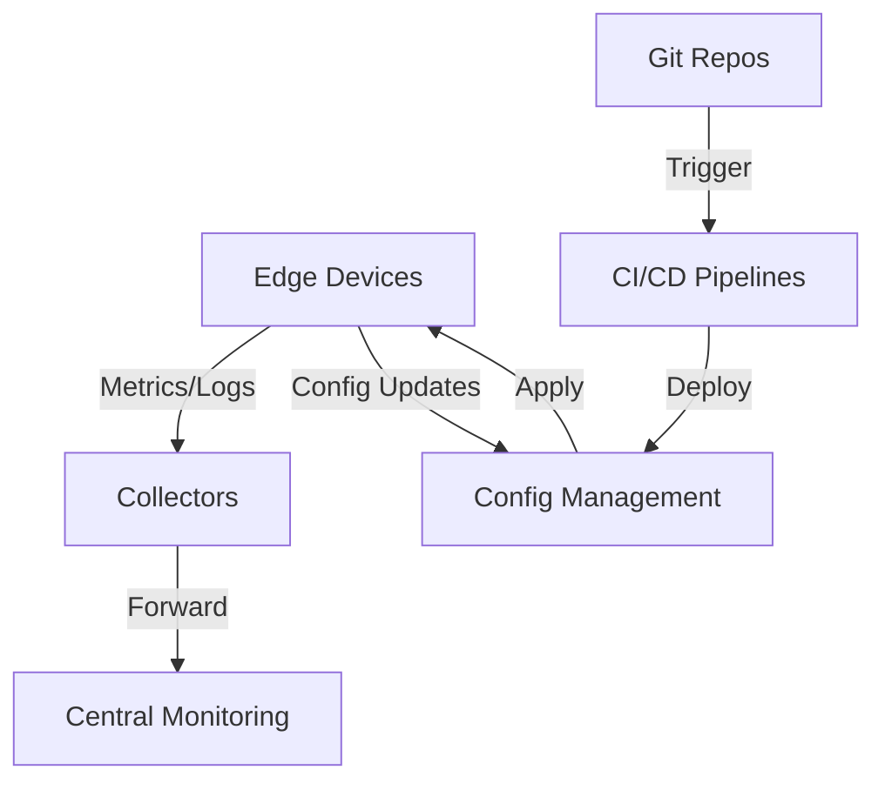

# Energy Sector DevOps: Edge Fleet Management at Scale

## Technical Architecture Overview

This guide covers implementing DevOps practices for managing thousands of edge devices (PLCs, RTUs, IoT gateways) in energy sector environments.

### Core Infrastructure Components



## Implementation Guide

### 1. Infrastructure as Code (IaC) Setup

```hcl
# modules/edge_device/main.tf
module "edge_fleet" {
  source = "./modules/edge-fleet"
  
  fleet_config = {
    device_count = 1000
    regions      = ["us-east-1", "us-west-2"]
    monitoring   = true
    tags = {
      environment = "production"
      type       = "plc-gateway"
    }
  }

  security_config = {
    enable_encryption = true
    rotation_period  = "72h"
    allowed_networks = ["10.0.0.0/8"]
  }
}
```

### 2. Monitoring Stack

```yaml
# prometheus/edge-exporters.yml
scrape_configs:
  - job_name: 'edge-fleet'
    scrape_interval: 30s
    static_configs:
      - targets:
        - 'edge-001.internal:9100'
        - 'edge-002.internal:9100'
    relabel_configs:
      - source_labels: [__address__]
        regex: '(edge-\d+)\..*'
        target_label: device_id

# grafana/alerts.yml
groups:
- name: edge-fleet
  rules:
  - alert: EdgeDeviceOffline
    expr: up{job="edge-fleet"} == 0
    for: 5m
    annotations:
      summary: "Edge device {{ $labels.device_id }} offline"
```

### 3. Configuration Management

```yaml
# ansible/roles/edge-config/tasks/main.yml
- name: Update Edge Device Configuration
  hosts: edge_devices
  become: yes
  tasks:
    - name: Ensure baseline config
      template:
        src: templates/device-config.j2
        dest: /etc/edge/config.yaml
        validate: /usr/local/bin/edge-validate --config %s
      notify: restart edge service

    - name: Apply security policies
      ansible.builtin.include_role:
        name: security-baseline

handlers:
    - name: restart edge service
      systemd:
        name: edge-agent
        state: restarted
```

### 4. CI/CD Pipeline

```yaml
# .github/workflows/edge-config-deploy.yml
name: Edge Config Deployment
on:
  push:
    paths:
      - 'edge-configs/**'
jobs:
  validate:
    runs-on: ubuntu-latest
    steps:
      - uses: actions/checkout@v3
      - name: Validate Configs
        run: |
          for config in edge-configs/*; do
            edge-validate $config
          done
  deploy:
    needs: validate
    runs-on: self-hosted
    steps:
      - name: Deploy to Canary
        run: ansible-playbook -i inventory/canary deploy.yml
      - name: Run Health Checks
        run: ./scripts/health-check.sh
      - name: Deploy to Production
        if: success()
        run: ansible-playbook -i inventory/prod deploy.yml
```

## SRE Best Practices

### SLO Implementation

```yaml
# prometheus/slo.yml
groups:
- name: edge-slos
  rules:
  - record: edge:uptime:ratio
    expr: |
      sum(rate(edge_uptime_total[24h])) 
      / 
      sum(rate(edge_uptime_total[24h])) + sum(rate(edge_downtime_total[24h]))

  - alert: SLOBudgetBurn
    expr: |
      edge:uptime:ratio < 0.995
    for: 1h
```

### Automation Runbooks

```python
# runbooks/auto_remediation.py
def handle_device_offline(device_id):
    # 1. Check connectivity
    if not check_network(device_id):
        trigger_network_reset(device_id)
    
    # 2. Verify configuration
    if detect_config_drift(device_id):
        apply_baseline_config(device_id)
    
    # 3. Update status
    update_incident_status(device_id)
```

## Toil Reduction Matrix

| Task | Before | After | Automation Method |
|------|---------|-------|------------------|
| Device Onboarding | Manual (30min/device) | Automated (2min/device) | Terraform + Ansible |
| Config Updates | SSH + Manual Changes | GitOps Pipeline | GitHub Actions + Ansible |
| Incident Response | Manual Investigation | Auto-remediation | Python + AWS Lambda |
| Patch Management | Scheduled Downtime | Rolling Updates | Kubernetes Operators |

## References

- [AWS IoT Core Terraform Provider](https://registry.terraform.io/providers/hashicorp/aws/latest/docs/resources/iot_thing)
- [Ansible Best Practices](https://docs.ansible.com/ansible/latest/user_guide/playbooks_best_practices.html)
- [Prometheus Operator](https://github.com/prometheus-operator/prometheus-operator)
- [GitOps with Flux](https://fluxcd.io/docs/get-started/)
