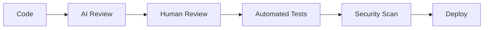

# Modern Development Practices (2024+)

## AI-Assisted Development

### LLM Integration Points

* Code Generation
* Code Review
* Documentation
* Security Analysis
* Testing Strategy

### Development Workflow



## Code Quality Gates

### Pre-commit Checks

```yaml
repos:
- repo: https://github.com/pre-commit/pre-commit-hooks
  rev: v4.5.0
  hooks:
    - id: trailing-whitespace
    - id: end-of-file-fixer
    - id: check-yaml
- repo: local
  hooks:
    - id: ai-code-review
      name: AI Code Review
      entry: copilot-cli suggest
      language: system
      types: [python, javascript, typescript]
```

### Automated Code Review

* Style Guide Enforcement
* Best Practice Validation
* Security Pattern Detection
* Performance Analysis

## Modern Testing Approaches

### Property-Based Testing

```python
from hypothesis import given, strategies as st

@given(st.integers(), st.integers())
def test_addition_properties(x, y):
    assert isinstance(x + y, int)
    assert x + y == y + x
```

### AI-Driven Test Generation

* Test Case Suggestions
* Edge Case Detection
* Coverage Analysis
* Test Maintenance

## Security Integration

### Continuous Security

* SAST/DAST Integration
* Dependency Scanning
* License Compliance
* Vulnerability Management

### Zero Trust Development

* Ephemeral Environments
* Just-in-Time Access
* Audit Logging
* Policy Enforcement

## Best Practices

1. **Code Generation**
   * AI-assisted scaffolding
   * Template customization
   * Style consistency
   * Documentation generation

2. **Review Process**
   * Automated first pass
   * Human oversight
   * Security validation
   * Performance analysis

3. **Testing Strategy**
   * AI-generated test cases
   * Property-based testing
   * Mutation testing
   * Integration validation
