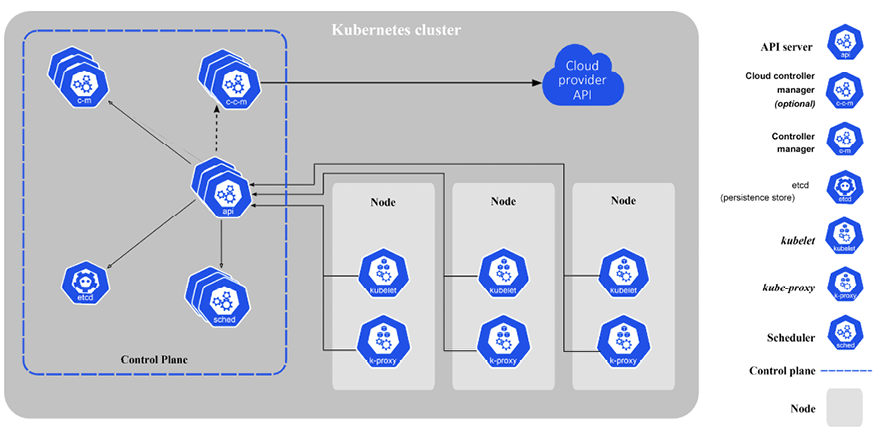

# Kubernetes concepts

In this section, we’ll briefly introduce many important Kubernetes concepts and give you some context as to why they are needed and how they interact with each other. The goal is to get familiar with these terms and concepts. Later, we will see how these concepts are woven together and organized into API groups and resource categories to achieve awesomeness. You can consider many of these concepts as building blocks. Some concepts, such as nodes and the control plane, are implemented as a set of Kubernetes components.

Here is the Kubernetes architecture diagram:

<figure><figcaption></figcaption></figure>

### Node <a href="#_idparadest-23" id="_idparadest-23"></a>

A node is a single host. It may be a physical or virtual machine. Its job is to run pods. Each Kubernetes node runs several Kubernetes components, such as the kubelet, the container runtime, and the kube-proxy. Nodes are managed by the Kubernetes control plane. The nodes are the worker bees of Kubernetes and shoulder all the heavy lifting. In the past they were called **minions**. If you read some old documentation or articles, don’t get confused. Minions are just nodes.

### Cluster <a href="#_idparadest-24" id="_idparadest-24"></a>

A cluster is a collection of hosts (nodes) that provide compute, memory, storage, and networking resources. Kubernetes uses these resources to run the various workloads that comprise your system. Note that your entire system may consist of multiple clusters. We will discuss this advanced use case of multi-cluster systems in detail later.

### Control plane <a href="#_idparadest-25" id="_idparadest-25"></a>

The control plane of Kubernetes consists of several components, such as an API server, a scheduler, a controller manager and, optionally, a cloud controller manager. The control plane is responsible for the global state of the cluster, cluster-level scheduling of pods, and handling of events. Usually, all the control plane components are set up on the same host although it’s not required. When considering high-availability scenarios or very large clusters, you will want to have control plane redundancy.&#x20;

### Pod <a href="#_idparadest-26" id="_idparadest-26"></a>

A pod is the unit of work in Kubernetes. Each pod contains one or more containers (so you can think of it as a container container). A pod is scheduled as an atomic unit (all its containers run on the same machine). All the containers in a pod have the same IP address and port space; they can communicate with each other using localhost or standard inter-process communication. In addition, all the containers in a pod can have access to shared local storage on the node hosting the pod. Containers don’t get access to local storage or any other storage by default. Volumes of storage must be mounted into each container inside the pod explicitly.

Pods are an important feature of Kubernetes. It is possible to run multiple applications inside a single container by having something like supervisor as the main process that runs multiple processes, but this practice is often frowned upon for the following reasons:

* **Transparency**: Making the containers within the pod visible to the infrastructure enables the infrastructure to provide services to those containers, such as process management and resource monitoring. This facilitates a number of conveniences for users.
* **Decoupling software dependencies**: The individual containers may be versioned, rebuilt, and redeployed independently. Kubernetes may even support live updates of individual containers someday.
* **Ease of use**: Users don’t need to run their own process managers, worry about signal and exit-code propagation, and so on.
* **Efficiency**: Because the infrastructure takes on more responsibility, containers can be more lightweight.

Pods provide a great solution for managing groups of closely related containers that depend on each other and need to co-operate on the same host to accomplish their purpose. It’s important to remember that pods are considered ephemeral, throwaway entities that can be discarded and replaced at will. Each pod gets a **unique ID** (**UID**), so you can still distinguish between them if necessary.

### Label <a href="#_idparadest-27" id="_idparadest-27"></a>

Labels are key-value pairs that are used to group together sets of objects, very often pods via selectors. This is important for several other concepts, such as replica sets, deployments, and services that operate on dynamic groups of objects and need to identify the members of the group. There is an NxN relationship between objects and labels. Each object may have multiple labels, and each label may be applied to different objects.

There are certain restrictions by design on labels. Each label on an object must have a unique key. The label key must adhere to a strict syntax. Note that labels are dedicated to identifying objects and are not for attaching arbitrary metadata to objects. This is what annotations are for (see the _Annotation_ section).

### Label selector <a href="#_idparadest-28" id="_idparadest-28"></a>

Label selectors are used to select objects based on their labels. Equality-based selectors specify a key name and a value. There are two operators, `=` (or `==`) and `!=`, for equality or inequality based on the value. For example:

```yaml
role = webserver
CopyExplain
```plaintext

This will select all objects that have that label key and value.

Label selectors can have multiple requirements separated by a comma. For example:

```yaml
role = webserver, application != foo
CopyExplain
```plaintext

Set-based selectors extend the capabilities and allow selection based on multiple values:

```yaml
role in (webserver, backend)
CopyExplain
```plaintext

### Annotation <a href="#_idparadest-29" id="_idparadest-29"></a>

Annotations let you associate arbitrary metadata with Kubernetes objects. Kubernetes just stores the annotations and makes their metadata available. Annotation key syntax has similar requirements as label keys.

In my experience, you always need such metadata for complicated systems, and it is nice that Kubernetes recognizes this need and provides it out of the box, so you don’t have to come up with your own separate metadata store and mapping object to their metadata.

### Service <a href="#_idparadest-30" id="_idparadest-30"></a>

Services are used to expose some functionality to users or other services. They usually encompass a group of pods, usually identified by – you guessed it – a label. You can have services that provide access to external resources, or pods you control directly at the virtual IP level. Native Kubernetes services are exposed through convenient endpoints. Note that services operate at layer 3 (TCP/UDP). Kubernetes 1.2 added the Ingress object, which provides access to HTTP objects – more on that later. Services are published or discovered via one of two mechanisms: DNS, or environment variables. Services can be load-balanced inside the cluster by Kubernetes. But, developers can choose to manage load balancing themselves in case of services that use external resources or require special treatment.

### Volume <a href="#_idparadest-31" id="_idparadest-31"></a>

Local storage used by the pod is ephemeral and goes away with the pod in most cases. Sometimes that’s all you need, if the goal is just to exchange data between containers of the node, but sometimes it’s important for the data to outlive the pod, or it’s necessary to share data between pods. The volume concept supports that need. The essence of a volume is a directory with some data that is mounted into a container.

There are many volume types. Originally, Kubernetes directly supported many volume types, but the modern approach for extending Kubernetes with volume types is through the **Container Storage Interface** (**CSI**). Most of the originally built-in volume types will have been (or are in the process of being) phased out in favor of out-of-tree plugins available through the CSI.

### Replication controller and replica set <a href="#_idparadest-32" id="_idparadest-32"></a>

Replication controllers and replica sets both manage a group of pods identified by a label selector and ensure that a certain number is always up and running. The main difference between them is that replication controllers test for membership by name equality and replica sets can use set-based selection. Replica sets are the way to go as they are a superset of replication controllers. I expect replication controllers to be deprecated at some point. Kubernetes guarantees that you will always have the same number of pods running as you specified in a replication controller, or a replica set. Whenever the number drops due to a problem with the hosting node or the pod itself, Kubernetes will fire up new instances. Note that, if you manually start pods and exceed the specified number, the replica set controller will kill some extra pods.

Replication controllers used to be central to many workflows, such as rolling updates and running one-off jobs. As Kubernetes evolved, it introduced direct support for many of these workflows, with dedicated objects such as **Deployment**, **Job**, **CronJob**, and **DaemonSet**. We will meet them all later.

### StatefulSet <a href="#_idparadest-33" id="_idparadest-33"></a>

Pods come and go, and if you care about their data then you can use persistent storage. That’s all good. But sometimes you want Kubernetes to manage a distributed data store such as **Cassandra** or **CockroachDB**. These clustered stores keep the data distributed across uniquely identified nodes. You can’t model that with regular pods and services. Enter **StatefulSet**. If you remember earlier, we discussed pets versus cattle and how cattle is the way to go. Well, StatefulSet sits somewhere in the middle. StatefulSet ensures (similar to a ReplicaSet) that a given number of instances with unique identities are running at any given time. StatefulSet members have the following properties:

* A stable hostname, available in DNS
* An ordinal index
* Stable storage linked to the ordinal and hostname
* Members are created and terminated gracefully in order

StatefulSet can help with peer discovery as well as adding or removing members safely.

### Secret <a href="#_idparadest-34" id="_idparadest-34"></a>

Secrets are small objects that contain sensitive info such as credentials and tokens. They are stored by default as plaintext in etcd, accessible by the Kubernetes API server, and can be mounted as files into pods (using dedicated secret volumes that piggyback on regular data volumes) that need access to them. The same secret can be mounted into multiple pods. Kubernetes itself creates secrets for its components, and you can create your own secrets. Another approach is to use secrets as environment variables. Note that secrets in a pod are always stored in memory (tmpfs in the case of mounted secrets) for better security. The best practice is to enable encryption at rest as well as access control with RBAC. We will discuss it in detail later.

### Name <a href="#_idparadest-35" id="_idparadest-35"></a>

Each object in Kubernetes is identified by a UID and a name. The name is used to refer to the object in API calls. Names should be up to 253 characters long and use lowercase alphanumeric characters, dashes (-), and dots (.). If you delete an object, you can create another object with the same name as the deleted object, but the UIDs must be unique across the lifetime of the cluster. The UIDs are generated by Kubernetes, so you don’t have to worry about it.

### Namespace <a href="#_idparadest-36" id="_idparadest-36"></a>

A namespace is a form of isolation that lets you group resources and apply policies. It is also a scope for names. Objects of the same kind must have unique names within a namespace. By default, pods in one namespace can access pods and services in other namespaces.

Note that there are cluster-scope objects like node objects and persistent volumes that don’t live in a namespace. Kubernetes may schedule pods from different namespaces to run on the same node. Likewise, pods from different namespaces can use the same persistent storage.

In multi-tenancy scenarios, where it’s important to totally isolate namespaces, you can do a passable job with proper network policies and resource quotas to ensure proper access and distribution of the physical cluster resources. But, in general namespaces are considered a weak form of isolation and there are other solutions more appropriated for hard multi-tenancy like virtual clusters..

We’ve covered most of Kubernetes’ primary concepts; there are a few more I mentioned briefly. In the next section, we will continue our journey into Kubernetes architecture by looking into its design motivations, the internals, and implementation, and even pick at the source code.
