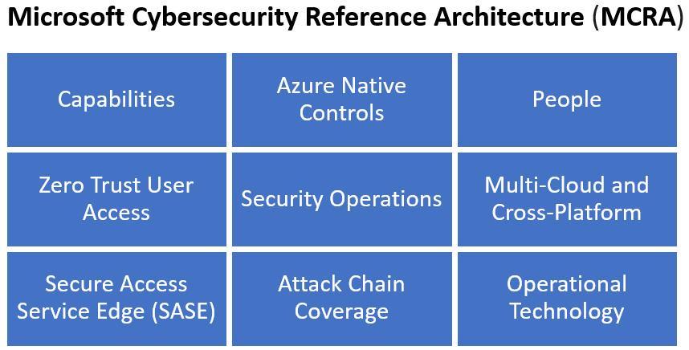

# MCRA

Microsoft has assisted in this process by creating the **Microsoft Cybersecurity Reference Architecture** (**MCRA**). The MCRA provide diagrams and templates that can assist the cybersecurity architect with identifying and planning for the various integration points of on-premises and multi-cloud security controls into Microsoft security posture management and security operations solutions, such as **Microsoft Defender for Cloud**, **Microsoft 365 Defender**, and **Microsoft Sentinel**. The MCRA, like other reference architecture diagrams and guides from Microsoft, are exactly what they are stated to be, for reference. They are not expected to be a comprehensive guide that covers every situation and scenario that a cybersecurity architect will uncover in their design, but it is a good starting point.

The MCRA and the various diagrams and templates can be found at this link: [https://docs.microsoft.com/en-us/security/cybersecurity-reference-architecture/mcra](https://docs.microsoft.com/en-us/security/cybersecurity-reference-architecture/mcra).

### What are the components of the MCRA? 

The MCRA are a set of diagrams, templates, and links that assist in the understanding and planning of a cybersecurity architecture that is integrated primarily with Microsoft. Even though the architecture diagrams focus on Microsoft solutions, they are helpful to the overall understanding of a complete cybersecurity architecture.

<figure><figcaption></figcaption></figure>

The MCRA are focused on the areas of resources, capabilities, controls, access, and operations:

* **Capabilities**: These are the capabilities that Microsoft has for security, compliance, and identity architecture for monitoring, managing, and operating a secure environment for public, hybrid, and multi-cloud infrastructures. As a cybersecurity architect, you should be familiar with these capabilities to provide a strong architecture for security, compliance, and identity.
* **People**: This is the most important asset of a company. As a cybersecurity architect, you should design an architecture that protects people from threats through a clear definition of roles and responsibilities. This could be identity theft, personal information, and reputation through possible exposure of resources that are within the company applications and data. Reputational damage also plays a role within the overall company and its board members if there is a cybersecurity event.
* **Zero-trust user access**: **Zero trust** is the concept of requiring constant verification of resources for access. This includes user access. Enforcing zero trust is a way to protect the people that are accessing resources from cybersecurity threats and stolen identities.
* **Attack chain coverage**: _Chapter 1_, _Cybersecurity in the Cloud_, discussed the cybersecurity attack chain and how designing a defense-in-depth architecture addresses these areas of the attack chain. The capabilities of **Microsoft Defender** solutions, **Microsoft Insider Risk Management**, and **Microsoft Sentinel** help to address this attack chain within Microsoft, hybrid, and multi-cloud infrastructures.
* **Security operations**: **Security Information and Event Management** (**SIEM**) and **Security Operation and Automated Response** (**SOAR**) solutions such as **Microsoft Sentinel** build a strong foundation for a company to build a **Security Operations Center** (**SOC**). The strength of a SOC is built on the ability to recognize and respond to possible threats and incidents. The cybersecurity architect will assist in the evaluation and use of the tools available.
* **Operational Technology**: This addresses the many connected devices within a company and how to design an architecture for these devices that utilizes zero trust. This helps these devices stop being gateways for attackers to gain access to critical applications and data.
* **Azure native controls**: Microsoft provides many native controls within their solutions for Microsoft 365 and Azure. This includes Azure AD capabilities for zero-trust enforcement, such as Conditional Access policies and Identity Protection. These Azure native controls are also found in many of the **Platform-as-a-Service** (**PaaS**) offerings for application services and databases with automated security patching and backups. Storage and databases are encrypted at rest by default to protect against threats. Microsoft Defender for Cloud is also enabled by default with auditing policies to provide guidance for building a strong security posture.
* **Multi-cloud and cross-platform**: Microsoft’s security, compliance, and identity protection tools are not just for Azure services. These capabilities can be utilized across Microsoft 365, Dynamics 365, Power Platform, SharePoint Online, and the entire Microsoft cloud solutions. In addition, Microsoft has built its solutions to be utilized for hybrid architectures with on-premises resources as well as multi-cloud infrastructures that utilize **Amazon Web Services** (**AWS**) and **Google Cloud Platform** (**GCP**). A cybersecurity architect can design an architecture in Microsoft that can address the entire security, compliance, and identity needs of a company.
* **Secure Access Service Edge** (**SASE**): The capabilities of Microsoft for Azure Native Controls, support for multi-cloud and cross-platform, and IoT OT provide the support and solutions to create a secure access service edge. The SASE utilizes these solutions and zero-trust methodologies to harden endpoints across the company architecture and monitor for threats and vulnerabilities.
