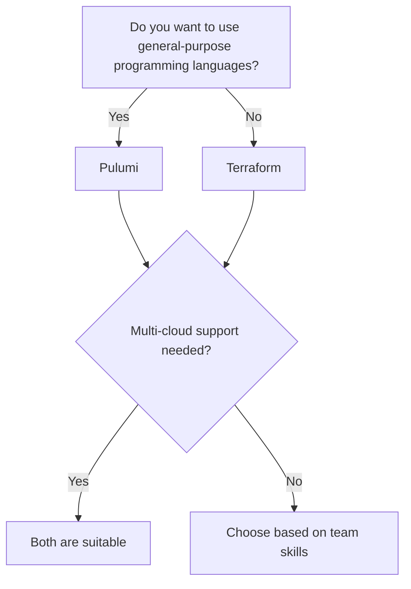

# Tool Decision Guides

This section provides practical decision trees and migration guides to help DevOps engineers select and transition between tools.

---

## Decision Trees

### Infrastructure as Code: Terraform vs. Pulumi



**Quick Reference Table**

| Criteria                | Terraform        | Pulumi           |
|-------------------------|------------------|------------------|
| Language                | HCL              | Python, TS, Go   |
| Ecosystem               | Mature           | Growing          |
| Learning Curve          | Medium           | Medium-High      |
| Multi-cloud             | Yes              | Yes              |
| Policy as Code          | Sentinel         | Open Policy Agent |
| Community               | Large            | Growing          |

---

## Migration Guides

### Jenkins to GitHub Actions

**Step-by-Step Migration:**

1. **Inventory Jenkins Jobs:**  
   List all jobs, triggers, and plugins in use.
2. **Map Plugins to Actions:**  
   Find equivalent GitHub Actions or Marketplace actions.
3. **Convert Pipelines:**  
   - Jenkinsfile → `.github/workflows/*.yml`
   - Example:
     ```yaml
     name: CI
     on: [push]
     jobs:
       build:
         runs-on: ubuntu-latest
         steps:
           - uses: actions/checkout@v4
           - name: Run tests
             run: ./gradlew test
     ```
4. **Secrets & Credentials:**  
   Move credentials to GitHub Secrets.
5. **Test & Validate:**  
   Run workflows, compare outputs, and iterate.
6. **Decommission Jenkins:**  
   After successful migration and validation.

**Common Pitfalls:**
- Missing plugin equivalents
- Environment differences (self-hosted vs. GitHub runners)
- Secret management changes

---

## See Also

- [DevOps Tool Comparison 2025](pages/reference/tool-comparison.md)