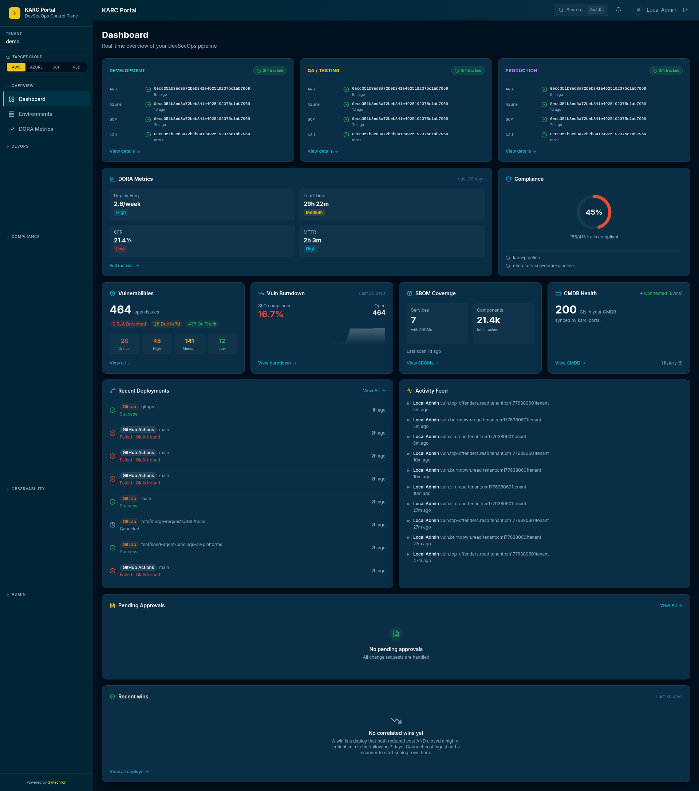

# Project Showcase

Featured projects with full architecture write-ups, screenshots, and the engineering decisions behind each one. For a short list of open-source proof-of-concept repos, see [About Me → Recent Projects](../about-me.md#recent-projects).

## Featured

### [Synechron ARC — Multi-Cloud Compliance Pipeline](synechron-arc.md)

A customer demo and reference platform that wires **ServiceNow + Kosli + GitLab / GitHub / Azure DevOps** into one auditable delivery pipeline, deployable to **AWS, Azure, GCP, or local k3d** with a single `TARGET_CLOUD` environment variable. Ships with a Next.js DevSecOps control plane covering 37+ portal surfaces — DORA, vulnerabilities with SLAs, SBOMs, control mapping, CMDB sync via ServiceNow IRE API, multi-cluster ArgoCD/Tekton, cost ↔ vulnerability correlation, AI Governance (NIST AI 600-1 + ISO 42001), and agent-dispatch automation.

